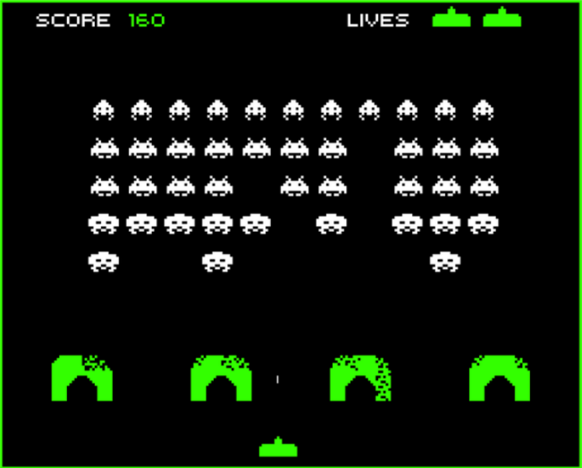

# Update Design Document

## Description
This project outlines a comprehensive update for the classic 1978 game, Space Invaders, aimed at revitalizing its gameplay for modern audiences while preserving its iconic essence.

The document proposes enhancements such as improved graphics, advanced animations, and additional gameplay modes, including online multiplayer, cooperative play, speedrun, and tryhard modes.

New mechanics like different firing options and secret power-ups add strategic depth and excitement.

The update maintains the original challenge and flow of the game, with an emphasis on modernizing the aesthetics and introducing new ways to engage players, making it suitable for contemporary gaming platforms.

## Documentation
For a detailed explanation of the design update and how it would function, please refer to the attached document in this GitHub repository. The document provides in-depth insights into the proposed changes, the design process, and the envisioned gameplay experience.
